# Bungee Jumper Dynamics 

## Prompt:

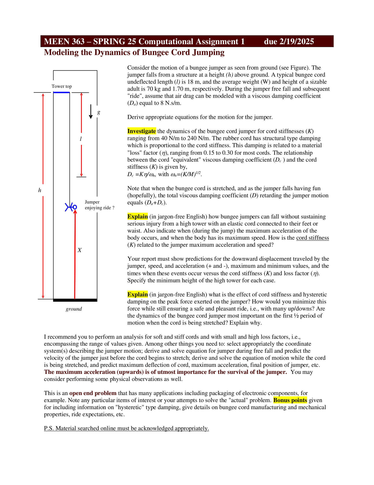
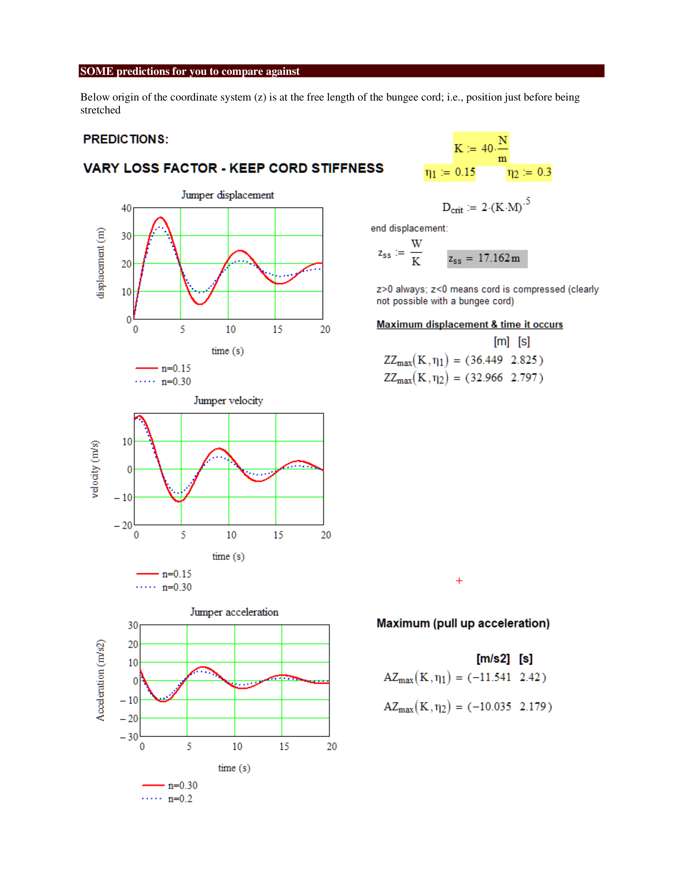

## Report:

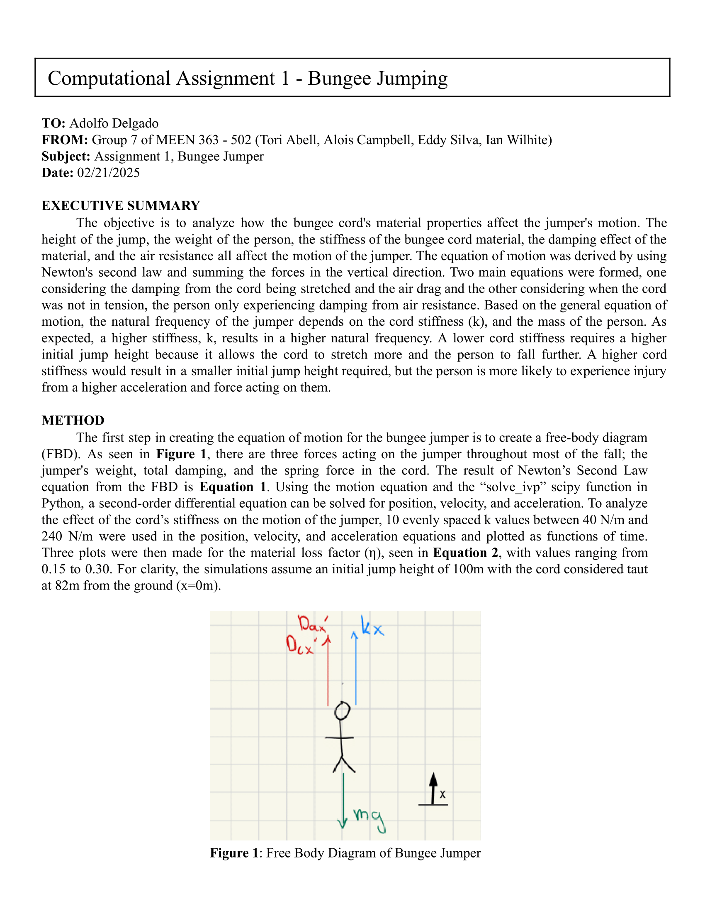
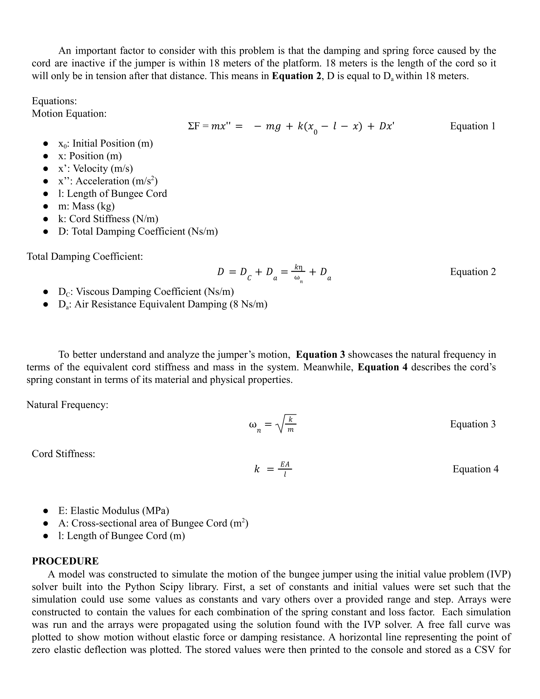
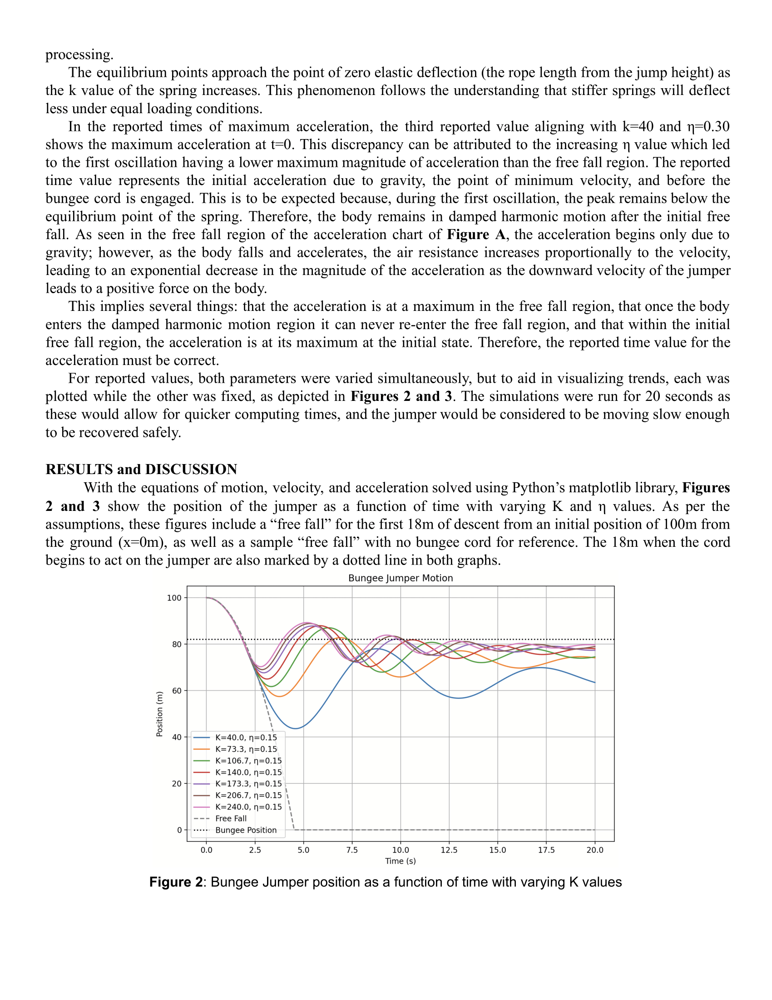
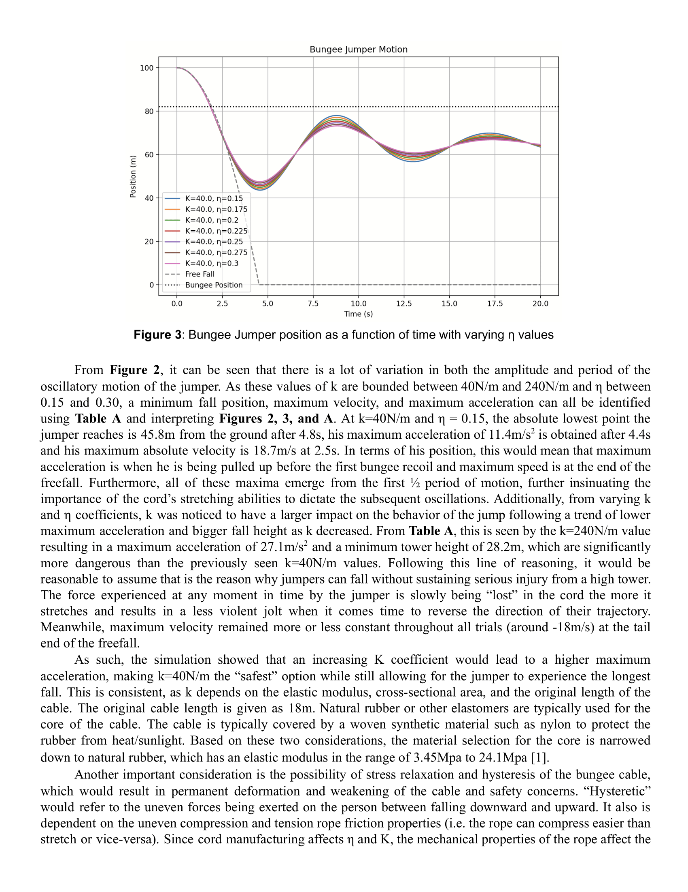
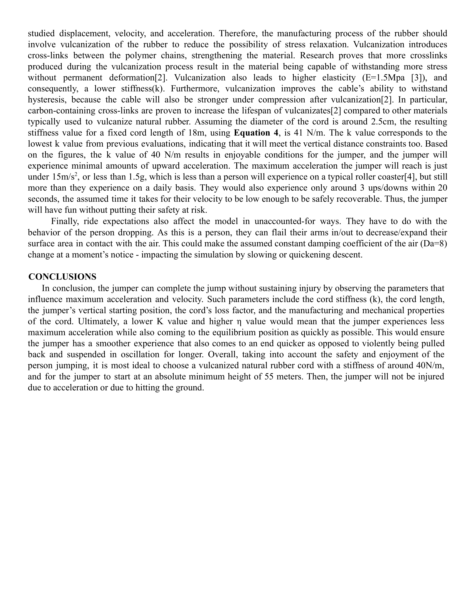
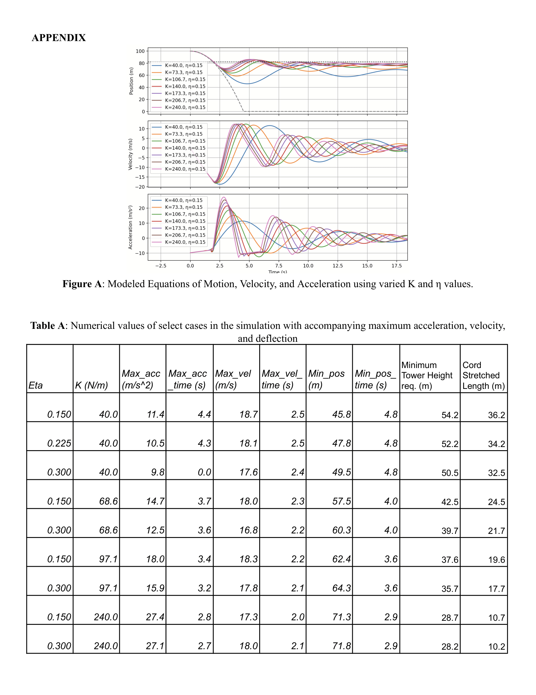
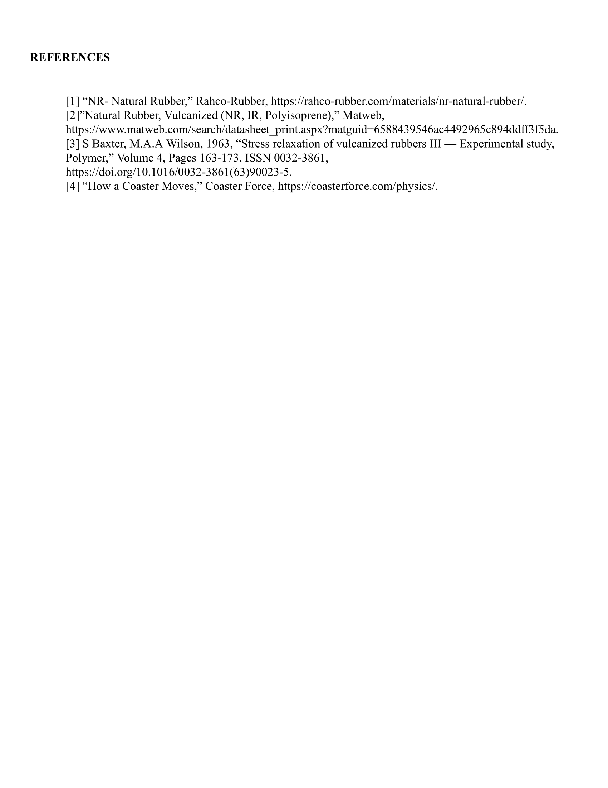

## Results:

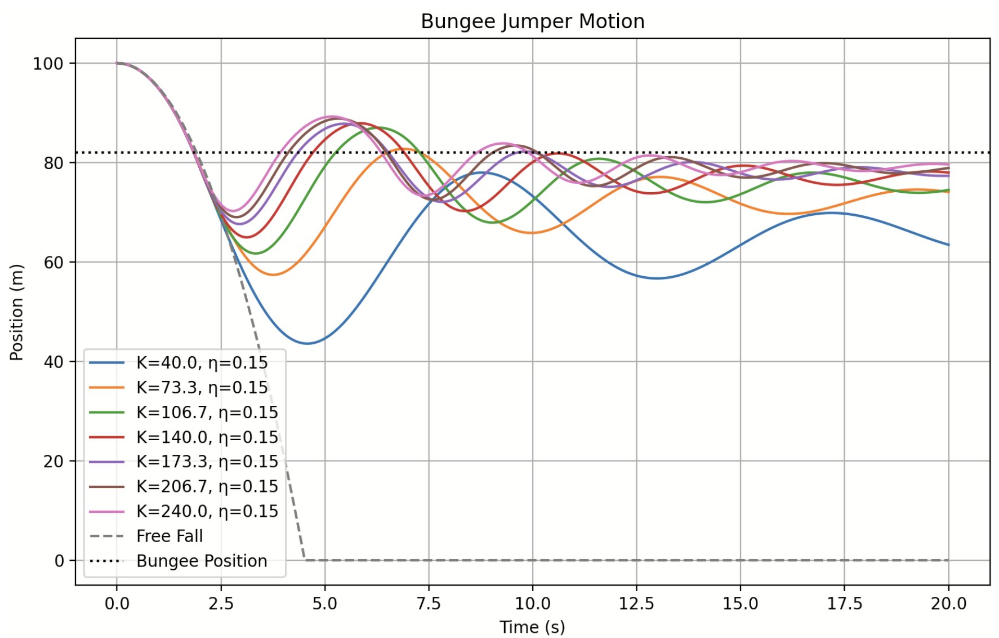
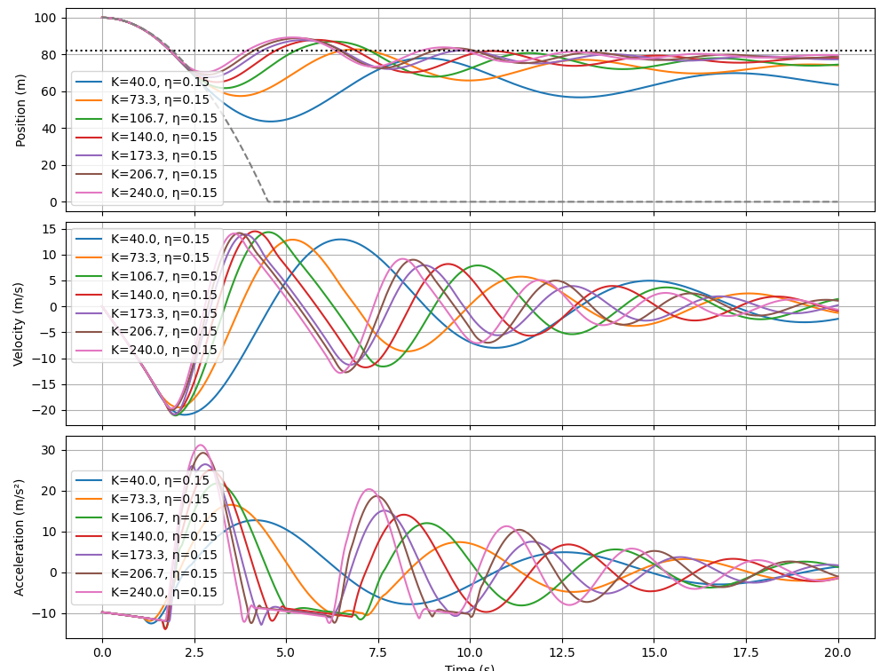
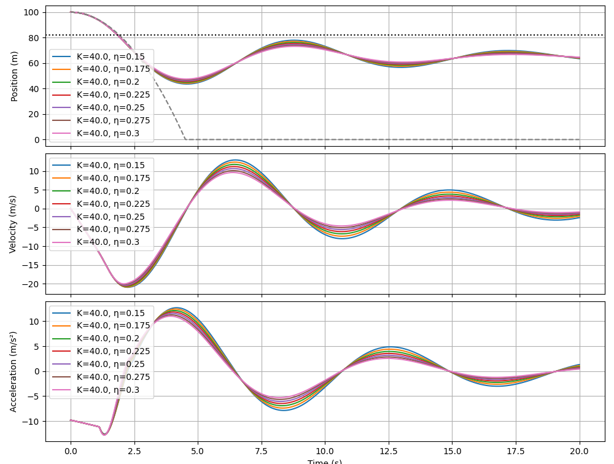
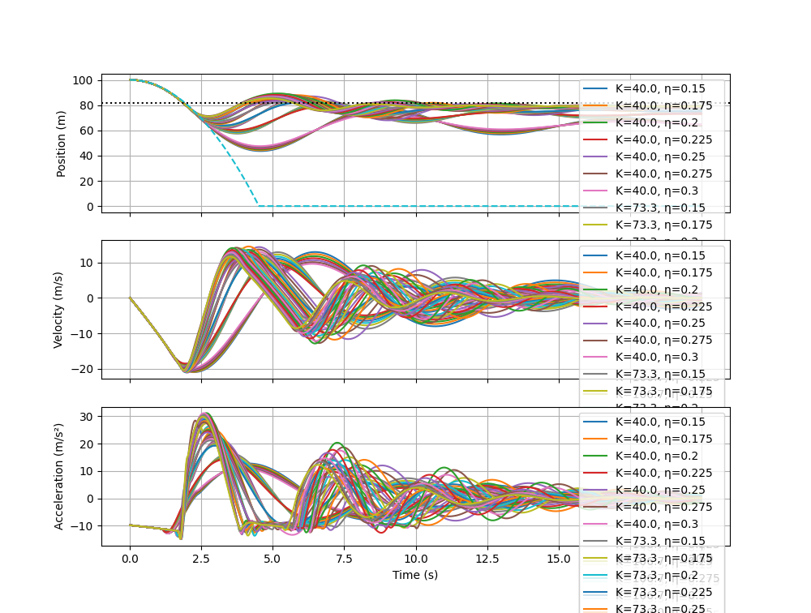

# Team:

 - [Ian Wilhite](https://www.linkedin.com/in/ian-wilhite/)
 - [Tori Abell](https://www.linkedin.com/in/victoriaabell2026/)
 - [Eddy Silva](https://www.linkedin.com/in/esilva04/)
 - [Alois Campbell](https://www.linkedin.com/in/alois-campbell/)